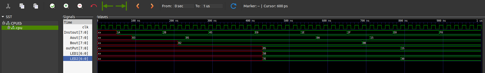

# 8-bit Microcomputer 💻

Welcome to the **8-bit Microcomputer** project! 🚀 This is a complete 8-bit computer designed and simulated entirely from the ground up in Verilog. This project brings classic computer architecture to life, featuring a custom-built CPU, a unique assembly language, and a full toolchain for simulation and verification.

This isn't just a CPU; it's a complete, functional computer system built on the Von Neumann architecture, where both instructions and data share the same memory space.

## ✨ Core Features

- 🧠 **Custom 8-bit CPU:** A modular CPU design with an Arithmetic Logic Unit (ALU), program counter, instruction controller, and registers, all written in Verilog.
- 🐍 **Full Toolchain:** Includes a custom assembler (`Assembler_v2.py`) built in Python that automatically translates assembly code into a ready-to-use Verilog RAM module.
- 🏛️ **Von Neumann Architecture:** A classic design where 16 bytes of RAM are shared for both program instructions and data.
- 📈 **Simulation & Verification:** Comes with a Verilog testbench and a `Makefile` for easy, one-command simulation using Icarus Verilog and waveform analysis with GTKWave.

## 📊 Simulation Waveform

The waveform below shows the successful execution of the demo assembly program, visualizing the activity on the bus and the changing values in the registers over time.

<div>
</img>
</div>

## 🛠️ Getting Started

There are two main ways to simulate this project: using the automated `make` command (the quickest method) or by running the commands manually.

### Prerequisites

- **Verilog Simulator:** **Icarus Verilog** (`iverilog`) is required.
- **Waveform Viewer:** **GTKWave** is needed to view the simulation output.
- **Python 3:** Required to run the assembler.
- **Make:** (Optional) Required if you want to use the automated `make` command.

### 1. Assemble the Program

This is the only required first step. This command converts your assembly code (`DemoProgram.asm`) into a ready-to-use Verilog RAM module.

To use the assembler, run one of the following commands:
```shell
python3 Assembler_v2.py <your_assembly_file.asm>
```

or

```shell
python Assembler_v2.py <your_assembly_file.asm>
```

This script will automatically update the `RAM.v` module in the `VerilogModules` folder with the new set of instructions. There's no need to copy and paste anything manually!

### 2. Run the Simulation

After assembling the program, choose one of the following methods to run the simulation.

#### Method A: Automated Simulation (Recommended)

This is the easiest way. Simply run the `make` command in your terminal. It will automatically compile, execute, and open the waveform viewer for you.

```shell
make
```

#### Method B: Manual Simulation

If you don't have `make` installed, are on Windows, or prefer manual control, you can run the simulation with these commands:

```shell
# 1. Navigate into the Verilog directory
cd VerilogModules

# 2. Compile the testbench and all modules with your simulator
iverilog CPU_tb.v

# 3. Run the compiled simulation (this creates the dump.vcd file)
vvp a.out

# 4. Open the waveform file with GTKWave
gtkwave dump.vcd
```

## 📁 Project Structure

```
.
├── VerilogModules/   # Contains all the Verilog source code for the computer's components.
├── outputFiles/      # Holds the simulation outputs, including the waveform dump.
├── Assembler_v2.py   # The custom assembler script (recommended).
├── Assembler_v1.py   # The original, manual assembler.
├── DemoProgram.asm   # An example assembly program to run on the computer.
└── Makefile          # Automates the compilation and simulation workflow.
```

> **Note on Assemblers:** This repository contains two versions. `Assembler_v2.py` is the recommended version as it directly updates the `RAM.v` file. The original `Assembler_v1.py` is also included for reference; it outputs to a `binary.txt` file and requires a manual copy-paste.
